## Ondemand Rest API

A simple rest api used to on demand services. Connecting between customer and service providers.

### How to run the apps :

#### 1. Clone the repository
```
$ git clone https://github.com/SutantoAdiNugroho/node-ondemand-apps.git
```

#### 2. Install dependencies
```
$ cd node-ondemand-apps
```
and then
```
$ npm install
```

#### 3. Configure .env file on the project
There is already a sample env file, and all the keywords from the env file must be filled in.

| Keywords        | Description                      |
| ----------------|----------------------------------|
| HOST_DB         | MongoDB host connection          |
| PORT            | Port to run the apps             |
| JWT_SECRET_KEY  | Key for build and sync JWT token |

#### 4. Launch the apps
Example command for running it locally :
```
$ npm run dev
```
After the apps running is succesfully, we can start by calling routes. For example :
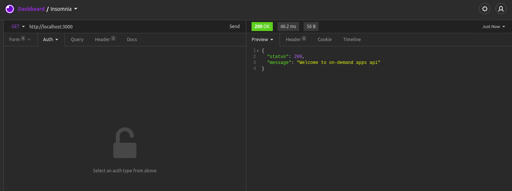

### API Guide And Documentation :

#### /api/auth

| Path             | Method | Description                           |
| ---              | -----  | ----                                  |
| /user/login      | POST   | Customers login, and return the token |
| /user/register   | POST   | Costumers register                    |
| /driver/login    | POST   | Drivers login, and return the token   |
| /driver/register | POST   | Drivers register                      |

#### /api/order

| Path                              | Method | Description                                             |
| ---                               | -----  | ----                                                    |
| /cust/allorders/:customersId      | GET    | Showing all orders made by customerId                   |
| /cust/makerequest                 | POST   | This is used if the customer makes an order             |
| /drv/neworders                    | GET    | Displays all the orders recently made by the customer   |
| /drv/allorders/:driversId         | GET    | Displays all orders that have been processed by driver  |
| /drv/pickup/:ordersId             | PUT    | Used for drivers who want to take the order, or update the order status  |

#### Status code of the order

```javascript
{
  request: "00",
  beingPickedUp: "01",
  delivering: "02",
  delayed: "03",
  finished: "90",
}
```

#### 1. Authentication

* ##### Customer's Register

    * Access URL : /api/auth/user/register 
    * Method     : POST
    * Parameters :
    
        | Name     | Type     | Description       |
        | ---      | -----    | ----              |
        | name     | string   | Name of customer  |
        | email    | string   | Email of customer |
        | password | string   | Password of customer  |
        | phoneNumber | number   | Phone number of customer  |
        
    * Example success response :
    

* ##### Customer's Login

    * Access URL : /api/auth/user/login 
    * Method     : POST
    * Parameters :
    
        | Name     | Type     | Description                                   |
        | ---      | -----    | ----                                          |
        | email    | string   | Email of customer                                 |
        | password | string   | Password of customer                              |
        
    * Example success response :
        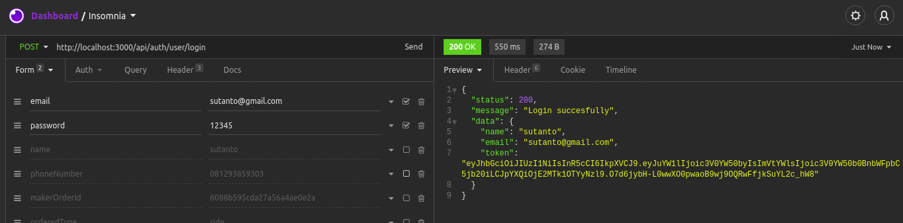

    * Example password incorrect response :
        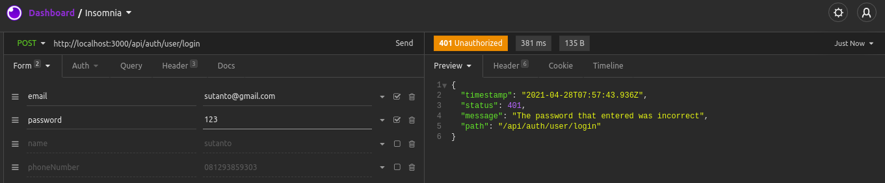

* ##### Driver's Register

    * Access URL : /api/auth/driver/register
    * Method     : POST
    * Parameters :
    
        | Name        | Type     | Description       |
        | ---         | -----    | ----              |
        | name        | string   | Name of driver  |
        | email       | string   | Email of driver |
        | password    | string   | Password of driver  |
        | phoneNumber | number   | Phone number of driver  |
        
    * Example success response :
        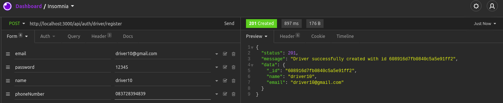

* ##### Driver's Login

    * Access URL : /api/auth/driver/login 
    * Method     : POST
    * Parameters :
    
        | Name     | Type     | Description                                   |
        | ---      | -----    | ----                                          |
        | email    | string   | Email of driver                                 |
        | password | string   | Password of driver                              |
        
    * Example success response :
        

    * Example password incorrect response :
        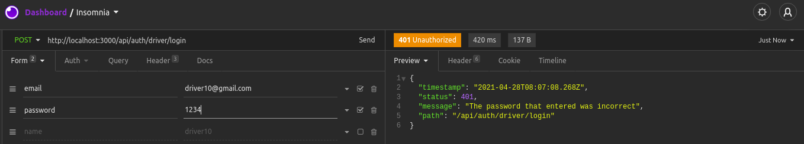


#### 2. Customer's Orders
* ##### Create orders

    * Access URL : /api/order/cust/makerequest
    * Method     : POST
    * Additional : Token of customer is needed when execute this endpoint
    * Parameters :
    
        | Name                        | Type       | Description                                   |
        | ---                         | -----      | ----                                          |
        | makerOrderId                | objectId   | ID of the customer                            |
        | orderedType                 | string     | Type of order, at least one "ride" or "food" is required for this field |
        | orderedLocation.latitude    | decimal    | Location latitude from order start |
        | orderedLocation.longitude   | decimal    | Location longitude from order start |
        | orderedDestination.latitude | decimal    | Location latitude from order destination |
        | orderedDestination.longitude | decimal    | Location longitude from order destination |
        | remark                      | string    | Order remark from customer |
        
    * Example success response :
        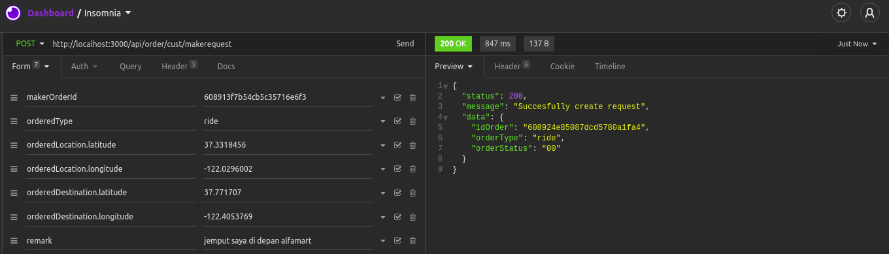

* ##### Show orders by customer id

    * Access URL : /api/order/cust/allorders/:customersId
    * Method     : GET
    * Additional : Token of customer is needed when execute this endpoint
    * Example success response :
        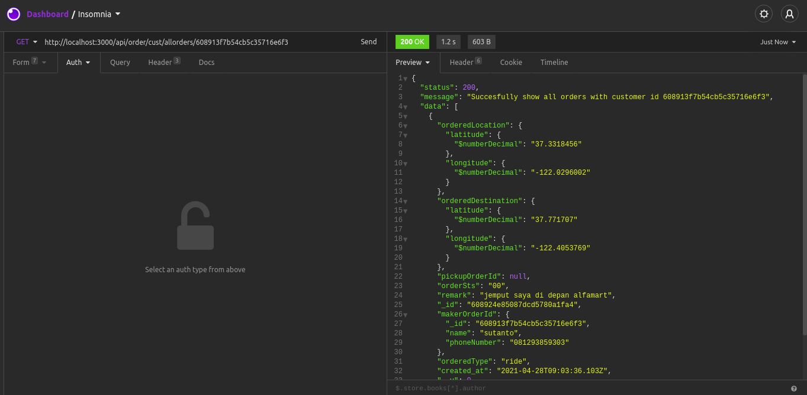

    * Example failed response without token :
        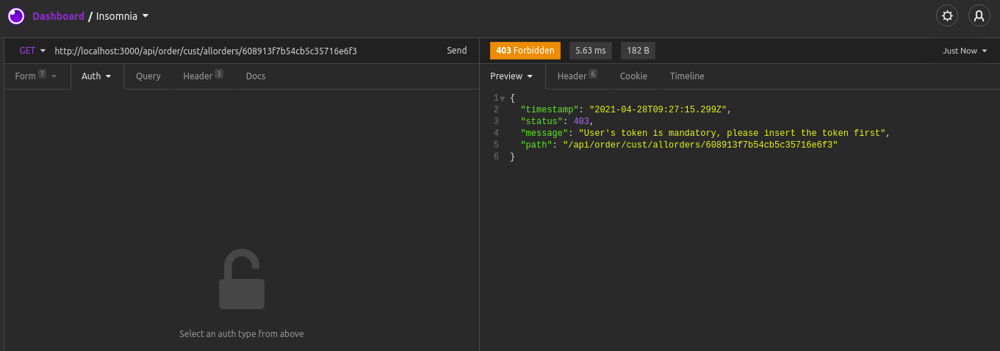

* ##### Show just one order

    * Access URL : /api/order/cd/oneorder/:orderId
    * Method     : GET
    * Additional : Token of customer or driver is needed when execute this endpoint
    * Example success response :
        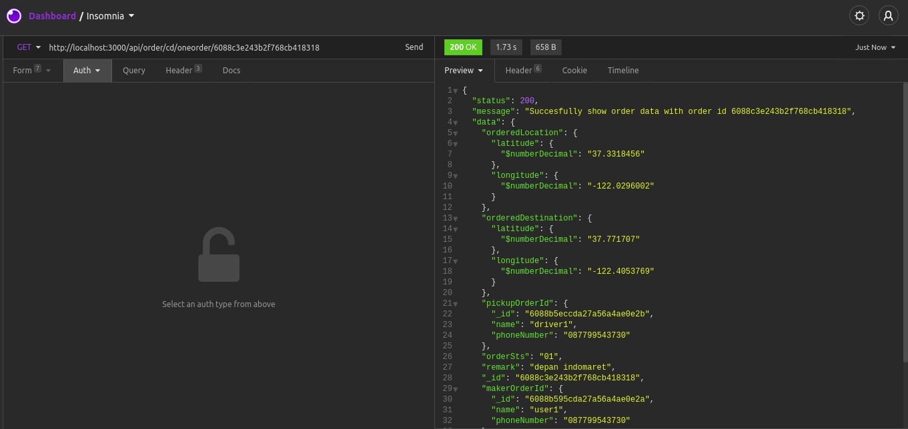

    * Example failed response without token :
        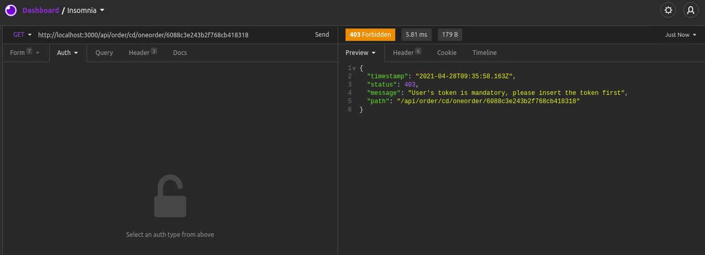

#### 3. Driver's Orders
* ##### Pickup or modify orders status

    * Access URL : /api/order/drv/pickup/:orderId
    * Method     : PUT
    * Additional : Token of customer is needed when execute this endpoint
    * Parameters :
    
        | Name                        | Type       | Description                                   |
        | ---                         | -----      | ----                                          |
        | driverId                    | objectId   | ID of the driver                              |
        | orderSts                    | string     | Status of order that will be change           |
        
    * Example success response :
        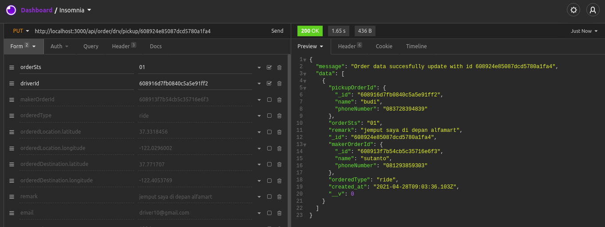

* ##### Showing all new orders

    * Access URL : /api/order/drv/neworders
    * Method     : GET
    * Additional : Token of driver is needed when execute this endpoint
    * Example success response :
        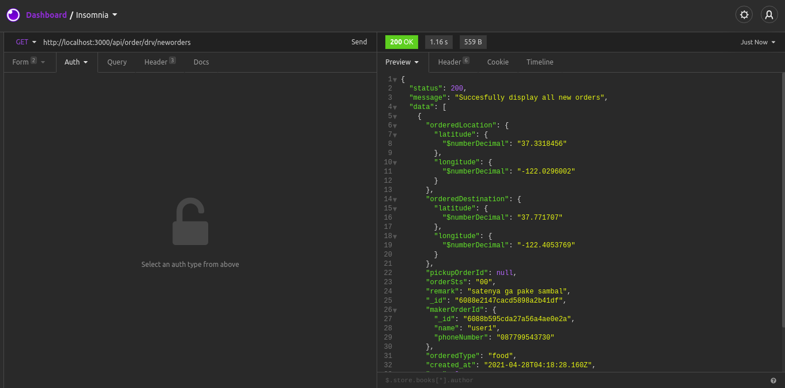
